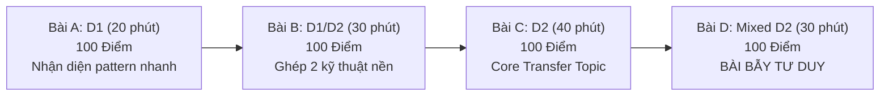

# ⏱️ BỘ QUY CHUẨN VÀ ĐỀ MẪU CHECKPOINT 2 TIẾNG (TOPIC CHECKPOINTS)

> **Mục đích duy nhất của Checkpoint:**  
> Xác định bạn đã thật sự **Master Topic (L3 - Transfer)** hay chỉ đang **học vẹt / nhớ đề (L1 - Template)**.  
> Không được tính bất kỳ bài D0 nào vào Checkpoint. Mọi đề thi Checkpoint đều phải là **4 bài Unseen (chưa từng đọc qua)**.

---

## 1. QUY CHẾ THI CHECKPOINT 120 PHÚT

1. **Không mở bất kỳ tài liệu nào** (trừ tài liệu C++ reference nếu quên cú pháp hàm STL).
2. **Không ChatGPT, không Copilot, không xem editorial.**
3. **Ẩn hoàn toàn Tag bài tập**: Không được biết trước bài này thuộc thuật toán nào.
4. **Quy định trợ giúp (Hint Protocol trong phòng thi):**
   - **Bài A & Bài B:** CẤM toàn bộ Hint. Không tự giải được trong thời gian quy định = 0 điểm bài đó.
   - **Bài C & Bài D:** Sau 20 phút suy nghĩ bế tắc hoàn toàn, chỉ được phép mở:
     - **H1 (Gợi ý nhỏ gián tiếp):** Trừ 30% điểm bài đó (chỉ nhận tối đa 70 điểm).
     - **H2 (Gợi ý hướng đi):** Trừ 60% điểm bài đó (chỉ nhận tối đa 40 điểm).
     - **CẤM H3 (nói tên thuật toán) và H4 (xem code/editorial):** Dùng H3/H4 = 0 điểm.
5. **Đồng hồ đếm ngược 120 phút liên tục**, không dừng khi đi vệ sinh hay uống nước.

---

## 2. MA TRẬN ĐỀ THI 120 PHÚT (4 BÀI CHUẨN)

| Bài | Độ khó | Thời gian chuẩn | Điểm tối đa | Mục tiêu kiểm tra |
| :---: | :---: | :---: | :---: | :--- |
| **Problem A** | **D1** | 20 phút | 100đ | Kiểm tra tốc độ gõ template & nhận diện pattern cơ bản không bị vấp. |
| **Problem B** | **D1/D2** | 30 phút | 100đ | Phối hợp 2 kỹ thuật (ví dụ: Sort + Two Pointers, hoặc Prefix Sum + Hash/Map). |
| **Problem C** | **D2** | 40 phút | 100đ | **Core Transfer của topic**: Đề bài ẩn dạng, tình huống đời sống hoặc trò chơi. Phải tự mô hình hóa sang bài toán thuật toán. |
| **Problem D** | **Mixed D2 (TRAP)** | 30 phút | 100đ | **Bài bẫy lối mòn:** Nhìn đề rất giống topic đang học nhưng lời giải tối ưu lại là kỹ thuật khác (Greedy/Two Pointers/Math). Bẫy những ai "tuần này học gì bài nào cũng đè cái đó ra làm". |

---

## 3. BẢNG XẾP LOẠI & HÀNH ĐỘNG SAU CHECKPOINT

Sau 120 phút, tính tổng điểm kiếm được:

| Tổng điểm | Kết quả bài tập | Xếp loại năng lực | Hành động kế tiếp |
| :---: | :---: | :---: | :--- |
| **400 / 400** | 4/4 AC0 | 🔥 **Mastery Tuyệt Đối (L4)** | Topic đã hoàn toàn vững. Chuyển sang topic mới ngay. |
| **300 – 370** | 3/4 AC0 (gồm Bài C) | 🟢🟢 **Rất Chắc (L3)** | Vượt qua bài Transfer chính. PASS topic. |
| **220 – 290** | $\ge 2$ AC0 (có $\ge 1$ bài D2) | 🟢 **ĐẠT (L2.5)** | Đạt mức chuyển giao cơ bản. PASS topic, lưu bài tạch vào Error Notebook. |
| **150 – 200** | Chỉ AC A + B, tạch C & D | ⚠️ **Mới Biết Template (L1.5)** | **CHƯA ĐẠT**. Bạn chỉ mới biết code khi người ta chỉ bài sẵn. Dành thêm 2 ngày luyện bài D2. |
| **< 150** | $< 2$ bài AC | ❌ **FAIL TOPIC (L0 - L1)** | Bị hổng nền tảng. Dừng roadmap, ôn lại lý thuyết và thi lại đề checkpoint khác sau 3 ngày. |

---

## 4. ĐỀ CHECKPOINT MẪU 1: PHASE 1 — FOUNDATION (27/09)
*(Topic: Prefix Sum, Two Pointers, Binary Search, Sorting & Greedy)*

### **Problem A: D1 (20 phút — 100đ) — [Kiểm tra Binary Search / Lower Bound]**
- **Đề bài tóm tắt:** Cho mảng $A$ gồm $N$ số nguyên dương. Có $Q$ truy vấn, mỗi truy vấn cho một số $X$. Hãy tìm giá trị trong mảng $A$ có giá trị nhỏ nhất nhưng $\ge X$. Nếu mọi phần tử đều $< X$, in `-1`.
- **Ràng buộc:** $N, Q \le 2 \times 10^5$, $1 \le A_i, X \le 10^9$. Thời gian: 1.0s.
- **Yêu cầu:** Nhận diện và gõ xong `std::sort` + `std::lower_bound` trong vòng 10–15 phút. Không lỗi off-by-one.

### **Problem B: D1/D2 (30 phút — 100đ) — [Sort + Two Pointers]**
- **Đề bài tóm tắt:** Cho mảng $A$ gồm $N$ số nguyên và một số nguyên $K$. Đếm số lượng cặp $(i, j)$ sao cho $i < j$ và $|A_i - A_j| \le K$.
- **Ràng buộc:** $N \le 2 \times 10^5$, $0 \le K \le 10^9$, $|A_i| \le 10^9$. Thời gian: 1.0s.
- **Yêu cầu:** Nhận diện việc sort mảng không làm đổi số lượng cặp $\to$ Sort mảng trong $O(N \log N)$, sau đó dùng Two Pointers hoặc Binary Search đếm số phần tử trong khoảng $[A_i, A_i + K]$. Tránh đếm trùng và dùng `long long` cho biến đếm kết quả.

### **Problem C: D2 (40 phút — 100đ) — [Binary Search on Answer + Greedy Check]**
- **Đề bài tóm tắt:** Có $N$ cuốn sách, cuốn thứ $i$ có $P_i$ trang. Cần chia $N$ cuốn sách này cho $K$ học sinh sao cho:
  1. Mỗi cuốn sách được giao cho đúng 1 học sinh.
  2. Mỗi học sinh nhận một đoạn sách liên tiếp nhau.
  3. Mỗi học sinh nhận ít nhất 1 cuốn sách.
  Hãy tìm cách chia sao cho số trang sách lớn nhất mà một học sinh phải đọc là **nhỏ nhất có thể**.
- **Ràng buộc:** $N \le 2 \times 10^5$, $K \le N$, $1 \le P_i \le 10^9$. Thời gian: 1.0s.
- **Nhận diện:** Cụm từ *"lớn nhất là nhỏ nhất"* (minimize the maximum) $\to$ Binary Search trên đáp án $X \in [\max(P_i), \sum P_i]$.
- **Hàm check(X):** Duyệt tham lam từ trái sang phải, gom nhiều sách nhất có thể vào 1 học sinh sao cho tổng $\le X$. Đếm xem cần bao nhiêu học sinh. Nếu số học sinh $\le K$ thì `true`.

### **Problem D: Mixed D2 — BÀI BẪY (30 phút — 100đ) — [Đề bẫy Binary Search]**
- **Đề bài tóm tắt:** Cho mảng $A$ gồm $N$ số nguyên dương. Tìm độ dài của đoạn con liên tiếp dài nhất sao cho **không có bất kỳ hai phần tử nào trong đoạn có giá trị bằng nhau**.
- **Ràng buộc:** $N \le 2 \times 10^5$, $1 \le A_i \le 10^9$. Thời gian: 1.0s.
- **CÁI BẪY:** Rất nhiều bạn vừa học Binary Search xong sẽ cố gắng Binary Search độ dài đoạn con $L$. Nhưng hàm `check(L)`: *"có tồn tại đoạn con độ dài L không trùng phần tử nào không"* **KHÔNG CÓ TÍNH ĐƠN ĐIỆU!** (Một đoạn dài có thể không thỏa, nhưng đoạn ngắn hơn chưa chắc đã tìm nhanh nếu cứ chia đôi).
- **LỜI GIẢI THỰC TỰ:** **Two Pointers (Sliding Window) + Hash Map / Frequency Array** chạy trong $O(N)$ hoặc $O(N \log N)$. Khi mở rộng con trỏ phải $R$, nếu gặp trùng lặp thì co con trỏ trái $L$ cho đến khi hết trùng.
- **Tiêu chí kiểm tra:** Người nào cố tình dùng Binary Search ở bài này sẽ bị TLE hoặc WA ngay lập tức. Đây là thước đo phân biệt người hiểu bản chất và người học vẹt.

---

## 5. ĐỀ CHECKPOINT MẪU 2: PHASE 2 — DP CHECKPOINT II (11/10)
*(Quy tắc đặc biệt: 4 bài unseen KHÔNG HỀ CÓ TAG DP, học sinh phải tự phát hiện)*

- **Problem A (D1 — 20m — 100đ):** Bài toán bước nhảy bậc thang có điều kiện tránh ô bẫy $\to$ DP 1D cơ bản $dp[i] = dp[i-1] + dp[i-2]$.
- **Problem B (D1/D2 — 30m — 100đ):** Tìm đường đi trên bảng lưới $N \times M$ có tổng chi phí nhỏ nhất, mỗi ô có đá cản $\to$ DP 2D Grid $dp[i][j] = \min(dp[i-1][j], dp[i][j-1]) + cost[i][j]$.
- **Problem C (D2 — 40m — 100đ):** Chọn đồ vật trong ba lô có 2 ràng buộc: khối lượng $\le W$ và thể tích $\le V$ sao cho tổng giá trị lớn nhất $\to$ Knapsack 2 chiều. Nhận diện trạng thái và lùi mảng 1D để tối ưu bộ nhớ.
- **Problem D (Mixed D2 — TRAP — 30m — 100đ):** Cho $N$ công việc với thời gian bắt đầu $S_i$ và kết thúc $E_i$. Chọn nhiều việc nhất không trùng giờ.
  - *Cái bẫy:* Rất nhiều người sẽ nghĩ ngay đến DP $O(N^2)$ (giống bài LIS).
  - *Lời giải tối ưu OLP:* **Greedy chọn theo thời gian kết thúc sớm nhất** $O(N \log N)$. Nếu làm DP sẽ chỉ ăn được 40% điểm subtask $N \le 1000$ và TLE ở subtask $N = 2 \times 10^5$.
